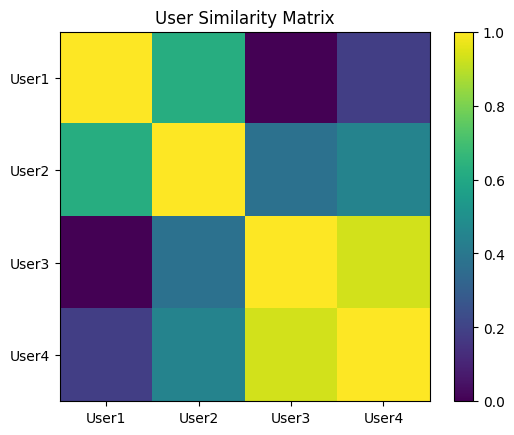

# Task 4: Recommendation System using Cosine Similarity

## Introduction

This project demonstrates the implementation of a basic Recommendation System using Cosine Similarity. Recommendation systems are widely used in platforms like Netflix, Amazon, and Spotify to suggest relevant items to users based on their preferences and past interactions.

## Objective

The objective of this project is to build a simple system that can recommend items (movies) to users based on similarity in their rating patterns.

## Dataset

A sample dataset is created representing user ratings for different movies. Each row represents a user, and each column represents a movie. The values indicate how a user has rated a particular movie.

## Methodology

The following steps were performed:

1. Created a user-item rating matrix using pandas.
2. Applied cosine similarity to measure similarity between users.
3. Generated a similarity matrix that shows how closely related users are.
4. Visualized the similarity matrix using a heatmap.

## Model Explanation

Cosine Similarity measures the similarity between two vectors by calculating the cosine of the angle between them. In this project, each user is represented as a vector of movie ratings. Users with similar rating patterns will have a higher similarity score.

## Results

The model successfully generated a user similarity matrix. The heatmap below visually represents the similarity scores between users.

## Conclusion

This project demonstrates how recommendation systems can be built using similarity measures. Even with a small dataset, it shows how users with similar preferences can be identified for making recommendations.

## Tools Used

* Python
* Pandas
* Scikit-learn
* Matplotlib
* Google Colab
